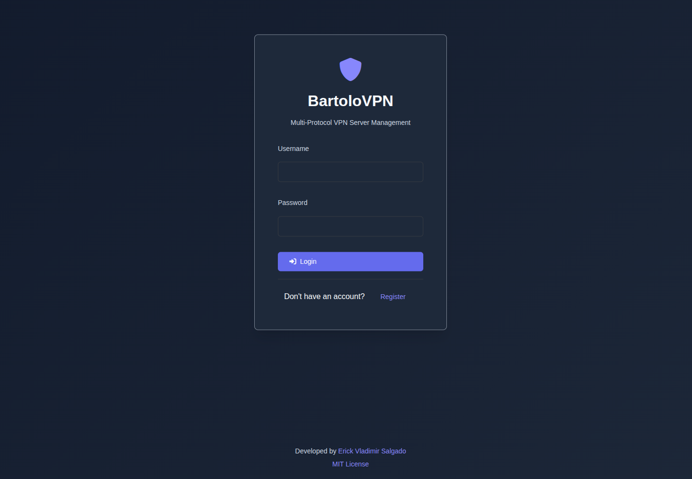
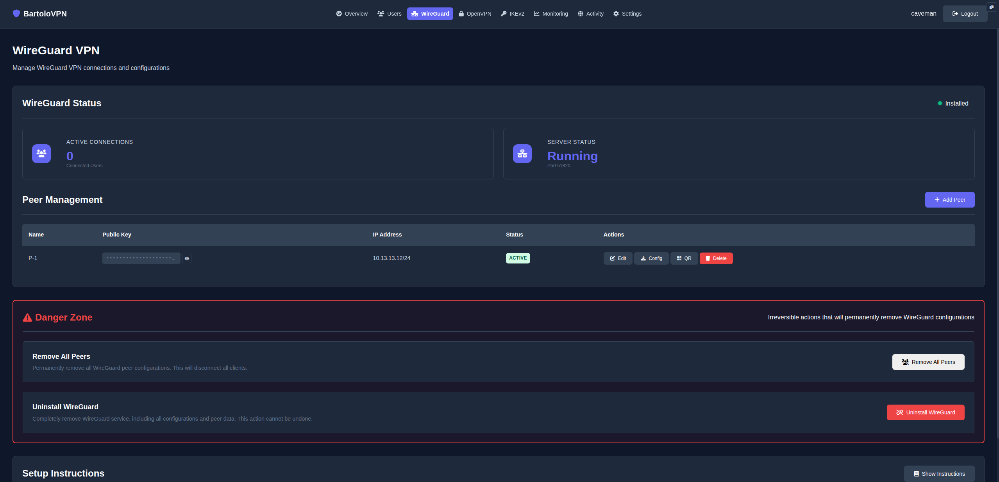
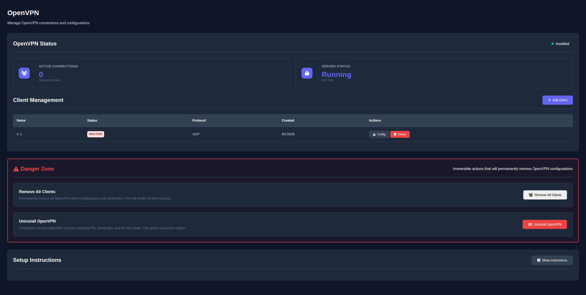
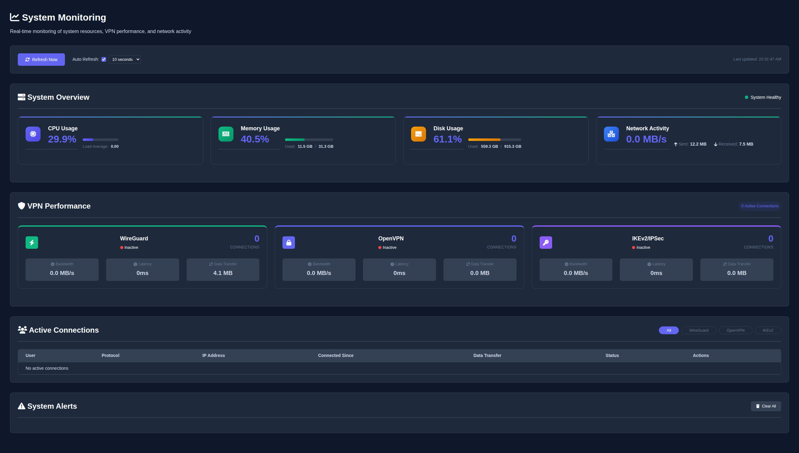
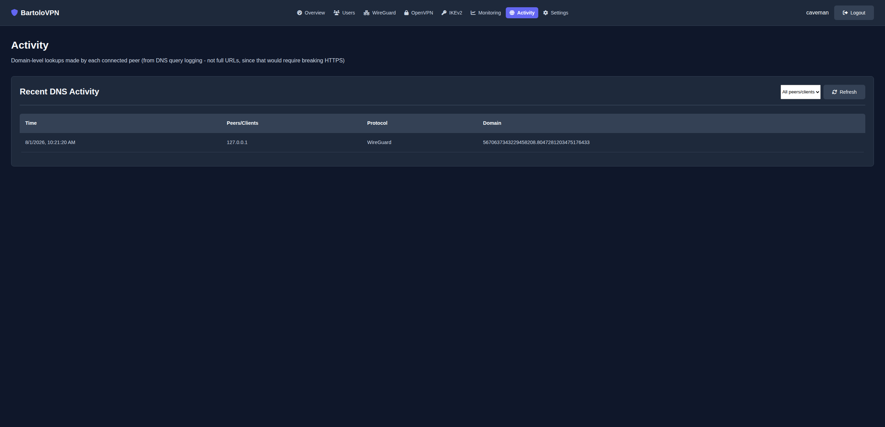

# 🛡️ BartoloVPN

**Multi-Protocol VPN Server with Web Management Interface**



## 📸 Screenshots

| WireGuard | OpenVPN |
|---|---|
|  |  |

| Monitoring | Activity |
|---|---|
|  |  |

[](https://opensource.org/licenses/MIT)
[](https://www.docker.com/)
[](https://www.python.org/)
[](https://fastapi.tiangolo.com/)

A comprehensive VPN server solution supporting **WireGuard**, **OpenVPN**, and **IKEv2** protocols with a modern web-based management interface. Built with Docker for easy deployment and management.

## 🌟 Features

### 🔐 VPN Protocols
- **WireGuard** - Modern, fast, and secure VPN protocol
- **OpenVPN** - Industry-standard VPN protocol with wide compatibility
- **IKEv2** - Enterprise-grade VPN protocol for mobile devices
- **Multi-protocol Support** - Run multiple VPN protocols simultaneously

### 🖥️ Web Management Interface
- **Real-time Dashboard** - Monitor system status and VPN connections
- **User Management** - Create, manage, and monitor VPN users with JWT authentication
- **Configuration Management** - One-click VPN client configuration generation
- **System Monitoring** - Real-time CPU, memory, disk, and network usage
- **Multi-user Support** - Secure user registration and authentication system
- **Mobile Support** - QR code generation for easy mobile client setup

### 🚀 Advanced Features
- **Multi-Region WireGuard** - Run real WireGuard servers in multiple countries and let peers pick which one to connect through, like a commercial VPN's country picker but backed by your own VPS. See [MULTI-REGION.md](MULTI-REGION.md).
- **One-Click Oracle Cloud Provisioning** - Add a new region by clicking "Add via Oracle" in the dashboard - it creates the Always Free VM, installs Docker, and deploys the region agent for you, no SSH required. Health checks query Oracle's real instance state, not just an HTTP ping.
- **Load Balancing** - HAProxy integration for high availability
- **IP Rotation** - Dynamic IP address rotation to avoid detection
- **Geo-spoofing** - Configure VPN to appear in different countries
- **Cloudflare Tunnel** - Secure remote access without port forwarding
- **Docker Networking** - Advanced container networking for scalability

## ⚖️ How It Compares

| | BartoloVPN | wg-easy | WireGuard-UI | Netmaker |
|---|---|---|---|---|
| Protocols | WireGuard, OpenVPN, IKEv2 | WireGuard only | WireGuard only | WireGuard (mesh) |
| Web UI | ✅ Full dashboard | ✅ Minimal | ✅ Minimal | ✅ Full dashboard |
| Multi-user accounts | ✅ | ❌ | ❌ | ✅ |
| QR code client setup | ✅ | ✅ | ✅ | ❌ |
| Geo-spoofing / IP rotation | ✅ | ❌ | ❌ | ❌ |
| Multi-region country picker | ✅ (real exit IPs, one-click Oracle provisioning) | ❌ | ❌ | ✅ (mesh, not country-picker style) |
| Load balancing (HAProxy) | ✅ | ❌ | ❌ | ❌ |
| Zero-config mesh networking | ❌ | ❌ | ❌ | ✅ |

BartoloVPN's niche is **protocol breadth** (run WireGuard, OpenVPN, and IKEv2 side by side from one dashboard) plus **geo-spoofing/IP rotation** and a **real multi-region country picker**, which the single-protocol WireGuard dashboards don't offer. If you need zero-config mesh networking across many nodes, Netmaker is the better fit; if you just want the simplest possible single-protocol WireGuard box, wg-easy is lighter weight.

## 🆕 What's New

### Latest Updates
- **Multi-Region WireGuard + One-Click Oracle Provisioning** - Real WireGuard servers in multiple countries, added from the dashboard's Regions tab with zero manual SSH on Oracle Cloud
- **Region-Aware Monitoring** - The Active Connections table and VPN Performance widget now include peers connected through remote regions, not just the local server
- **Real DNS Activity Logging** - The Activity tab now shows genuine per-peer domain lookups
- **User Authentication** - Secure JWT-based authentication system
- **FastAPI Backend** - Migrated from Flask for better performance
- **Enhanced Security** - Improved password hashing and security practices
- **Modern UI** - Responsive design with real-time updates
- **Comprehensive Logging** - Detailed system and VPN logs

## 🏗️ Architecture

```
┌─────────────────┐    ┌─────────────────┐    ┌─────────────────┐
│   Web Interface │    │   FastAPI       │    │   VPN Services  │
│   (Port 5000)   │◄──►│   Backend       │◄──►│   WireGuard     │
│                 │    │   (Port 5000)   │    │   OpenVPN       │
└─────────────────┘    └─────────────────┘    │   IKEv2         │
                                             └─────────────────┘
┌─────────────────┐    ┌─────────────────┐
│   HAProxy       │    │   SQLite        │
│   Load Balancer │    │   Database      │
│   (Port 8081)   │    │                 │
└─────────────────┘    └─────────────────┘
```

## 🚀 Quick Start

### Prerequisites
- Docker and Docker Compose
- Linux system with kernel modules support
- Port 5000, 51820, 1194, 500, 4500 available

### 1. Clone the Repository
```bash
git clone https://github.com/Cuban100/BartoloVPN.git
cd BartoloVPN
```

### 2. Configure Environment
```bash
# Copy and edit the environment file
cp env.example .env
nano .env
```

Make sure to set strong credentials for:
- `WEB_USERNAME`
- `WEB_PASSWORD`
- `JWT_SECRET_KEY`
- `IKEV2_PSK`
- `REGION_AGENT_ENCRYPTION_KEY` (only needed if you use the multi-region feature - see `MULTI-REGION.md`)

### 3. Start the Services
```bash
# Start all services
docker-compose up -d

# Check status
docker-compose ps
```

### 4. Access the Web Interface
- **Local Access**: http://localhost:5000
- **Remote Access**: http://your-server-ip:5000
- **Default Admin**: Use credentials from your `.env` file (WEB_USERNAME/WEB_PASSWORD)

## 📋 Configuration

### Environment Variables
```bash
# Server Configuration
SERVER_IP=your-server-ip
DOMAIN=your-domain.com

# Web Interface
WEB_USERNAME=admin
WEB_PASSWORD=your-secure-password

# VPN Protocols
WIREGUARD_PORT=51820
OPENVPN_PORT=1194
IKEV2_PSK=your-ikev2-pre-shared-key

# Security
JWT_SECRET_KEY=your-super-secret-jwt-key
REGION_AGENT_ENCRYPTION_KEY=your-region-agent-encryption-key
```

### VPN Client Setup

#### WireGuard
1. Access web interface → WireGuard tab
2. Click "Add Peer" to create new configuration
3. Download QR code or configuration file
4. Import into WireGuard client

#### OpenVPN
1. Access web interface → OpenVPN tab
2. Click "Add Client" to generate configuration
3. Download .ovpn file
4. Import into OpenVPN client

#### IKEv2
1. Access web interface → IKEv2 tab
2. Create user credentials with username/password
3. Configure client with server IP and credentials
4. Connect using native VPN clients

## 🔧 Advanced Features

### IP Rotation
```bash
# Manual rotation
./scripts/docker-network-rotation.sh rotate

# Continuous rotation (every hour)
./scripts/docker-network-rotation.sh continuous
```

### Geo-spoofing
```bash
# Configure for Sweden
./scripts/geo-spoofing.sh sweden

# Configure for other countries
./scripts/geo-spoofing.sh germany
./scripts/geo-spoofing.sh japan
```

### Cloudflare Tunnel Setup
```bash
# Setup secure remote access
./scripts/setup-cloudflare-tunnel.sh
```

### Backup & Restore
```bash
# Back up VPN configs/keys and the database (needs sudo - the WireGuard
# container creates config/wireguard/* as root)
sudo ./scripts/backup.sh

# Restore from a backup (stop the stack first: docker-compose down)
sudo ./scripts/restore.sh backups/bartolovpn-backup-20260101-120000.tar.gz
```
Note: `.env` (JWT secret, admin password) is intentionally excluded from backups - store it separately.

## 📊 Monitoring

### System Status
- **Real-time Metrics**: CPU, memory, and disk usage
- **VPN Statistics**: Active connections and bandwidth usage
- **Network Monitoring**: Real-time traffic analysis
- **Service Health**: Automatic status checks and alerts
- **Audit Logs**: Detailed access and configuration logs

### Logs
```bash
# View all logs
docker-compose logs

# View specific service logs
docker-compose logs vpn-api
docker-compose logs wireguard
docker-compose logs openvpn
docker-compose logs ikev2
```

## 🔒 Security Features

- **JWT Authentication** - Secure API access
- **Password Hashing** - bcrypt for user passwords
- **SSL/TLS** - Encrypted communications (via Cloudflare Tunnel or your own reverse proxy)
- **Network Isolation** - Docker network segmentation
- **Privileged Containers** - Minimal required permissions
- **Cloudflare Tunnel** - Zero-trust remote access

## 📚 Documentation

### Setup Guides
- **[Multi-Region Guide](MULTI-REGION.md)** - Run real WireGuard servers in multiple countries, including one-click Oracle Cloud provisioning
- **[Cloudflare Tunnel Setup](cloudflare-tunnel-setup.md)** - Secure remote access configuration
- **[Local TLS Setup](TLS-SETUP.md)** - HTTPS via your own domain + Let's Encrypt, without Cloudflare
- **[Geo-spoofing Guide](GEO-SPOOFING.md)** - Location spoofing configuration

### Quick Reference
- **[Quick Start Guide](QUICKSTART.md)** - Get up and running in 5 minutes
- **[Contributing Guidelines](CONTRIBUTING.md)** - How to contribute to the project
- **[Changelog](CHANGELOG.md)** - Project version history

## 🛠️ Development

### Project Structure
```
BartoloVPN/
├── api/                    # FastAPI backend (central dashboard)
│   ├── main.py            # Main application
│   ├── database.py        # Database models
│   ├── config.py          # Configuration
│   ├── oracle_service.py  # Oracle Cloud auto-provisioning
│   ├── region_client.py   # HTTP client for talking to region agents
│   ├── region_service.py  # Region CRUD + health checks
│   └── requirements.txt   # Python dependencies
├── region-agent/           # Deployed on each remote VPS for multi-region
│   ├── agent.py            # Minimal authenticated peer CRUD + health API
│   └── wireguard_core.py   # Peer lifecycle logic (mirrors api/main.py's local version)
├── web/                   # Frontend
│   ├── templates/         # Jinja2 templates
│   └── static/           # CSS, JS, images
├── scripts/              # Utility scripts (includes provision-region.sh)
├── config/               # VPN configurations
├── docker-compose.yml    # Service orchestration
└── README.md            # This file
```

### API Endpoints
- `GET /` - Web interface
- `GET /api` - API information
- `GET /health` - Health check
- `POST /auth/register` - User registration
- `POST /auth/login` - User authentication
- `GET /vpn/wireguard/status` - WireGuard status
- `POST /vpn/wireguard/peers` - Create WireGuard peer (optional `region`, defaults to local)
- `GET /regions` / `POST /regions` - List/add multi-region WireGuard servers
- `POST /regions/oracle` - One-click Oracle Cloud region provisioning
- `POST /regions/{id}/health-check` - Check a region's real status

### Contributing
1. Fork the repository
2. Create a feature branch
3. Make your changes
4. Add tests if applicable
5. Submit a pull request

## 📝 License

This project is licensed under the MIT License - see the [LICENSE](LICENSE) file for details.

## 👨‍💻 Developer

**Erick Vladimir Salgado**
- GitHub: [@Cuban100](https://github.com/Cuban100)
- Email: pctechservices.llc@gmail.com

## 🙏 Acknowledgments

- [WireGuard](https://www.wireguard.com/) - Modern VPN protocol
- [OpenVPN](https://openvpn.net/) - Industry-standard VPN
- [strongSwan](https://www.strongswan.org/) - IKEv2 implementation
- [FastAPI](https://fastapi.tiangolo.com/) - Modern web framework
- [Docker](https://www.docker.com/) - Container platform

## 🆘 Support

- **Issues**: [GitHub Issues](https://github.com/Cuban100/BartoloVPN/issues)
- **Documentation**: [Wiki](https://github.com/Cuban100/BartoloVPN/wiki)
- **Discussions**: [GitHub Discussions](https://github.com/Cuban100/BartoloVPN/discussions)

---

**Made with ❤️ by Erick Vladimir Salgado**
